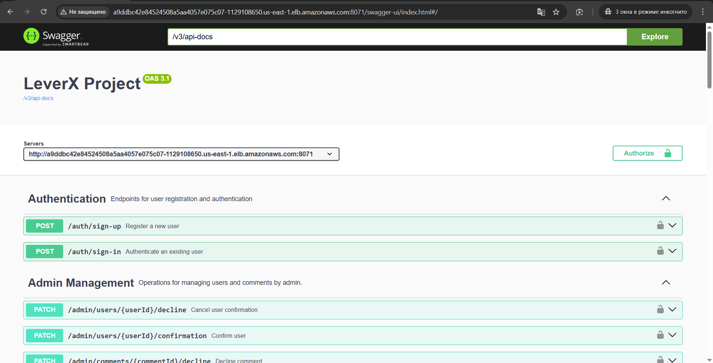

# Game Seller Rating Platform

An independent rating system for sellers of in-game items (CS:GO, FIFA, Dota, Team Fortress, etc.) based on verified user comments.

---

## Table of Contents

- [Project Overview](#project-overview)
- [User Roles & Scenarios](#user-roles--scenarios)
- [Core Functionality](#core-functionality)
- [Registration & Authorization](#registration--authorization)
- [Testing](#testing)
- [Development & Deployment](#development--deployment)
- [Technologies & Advantages](#technologies--advantages)
- [API Documentation](#api-documentation)

---

## Project Overview

The goal of the project is to provide an **independent rating system** for in-game item sellers. Users leave comments that are thoroughly verified by trusted individuals; these ratings form the basis of the overall top sellers in various game categories.

*Figure: Overview of the platform architecture.*

---

## User Roles & Scenarios

### Roles
- **Administrator:** Oversees moderation, verifies seller registrations and user comments.
- **Seller:** Registers on the platform and manages their profile.
- **Anonymous User:** Views seller profiles, submits comments, and even initiates the creation of a seller profile if one isn’t found.

### Scenarios
- **Seller Registration:**  
  A seller fills out the registration form. The administrator reviews and approves or declines the request.
- **Submitting a Comment:**  
  An anonymous user leaves a comment on a seller's profile; the comment is then verified by the administrator.
- **Creating a Seller Profile via Comment:**  
  If the seller is not found, the user can provide additional details to create a profile, which is subject to administrator approval.

---

## Core Functionality

- Creation of seller profiles  
- Submission, editing, and deletion of comments  
- Calculation of seller ratings based on verified comments  
- Compilation of an overall list of top sellers  
- Filtering by game category and rating ranges

---

## Registration & Authorization

- **User Registration:**  
  Users provide required details and receive a confirmation email containing a code. The system stores this code in a cache (e.g., Redis) with a 24-hour expiration. Until confirmation, login attempts return an error message.
  
- **Password Reset Flow:**  
  Users can request a password reset, receive a reset code by email, and then set a new password after code verification.

---

## Testing

The project includes:
- **Unit Tests:** 2 tests  
- **Integration Tests:** 2 tests

---

## Development & Deployment

### Development Stages
1. **Database Design:**  
   Plan and create the database schema (see architecture diagram above).
2. **Project Architecture:**  
   Design the file and folder structure.
3. **Phases & Estimation:**  
   Divide the work into phases (e.g., Registration, Authorization) and provide rough time estimates (see `estimate.md`).
4. **Development:**  
   Code development with frequent commits and pull requests upon task completion.

### Deployment
- **Cloud Deployment:**  
  Deployed using SAP BTP solutions.
- **Logging:**  
  Integrated a service for log collection and monitoring.
- **Feature Flags:**  
  A feature flag service controls console log output via SAP BTP.
- **Kubernetes:**  
  The application is deployed in a remote Kubernetes cluster (Kyma) through SAP BTP.

---

## Technologies & Advantages

- **Modern Tech Stack:**  
  Utilizes the latest frameworks and tools.
- **Custom Authorization:**  
  Implements a proprietary authentication and authorization system.
- **SAP BTP Integration:**  
  Enables cloud deployment, logging, and feature flag management.
- **Containerization:**  
  Deployed on Kubernetes (Kyma) for scalability and high availability.

*Figure: Example of API documentation via Swagger UI.*

---

## API Documentation

Explore and test the API via the Swagger interface:  
[Swagger OpenAPI Documentation](http://a9ddbc42e84524508a5aa4057e075c07-1129108650.us-east-1.elb.amazonaws.com:8071/swagger-ui/index.html#/)

---

*This project successfully meets all the specified requirements and demonstrates a comprehensive approach to modern web development.*
